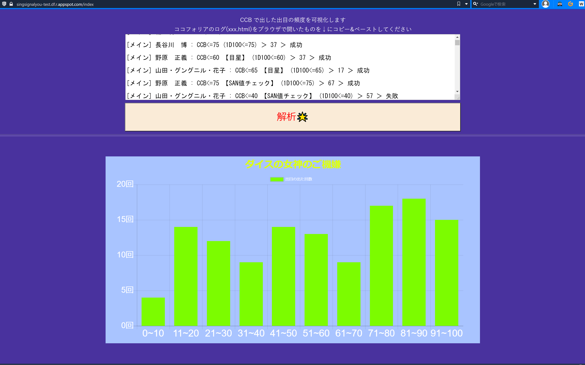

# Log Analyzer 👾
[Check here](https://singsignalyou-test.df.r.appspot.com/index)

## Construct
| Backend | Frontend                 | Infrastructure              | 
| ------------ | ------------------------------ | --------------------- | 
| Python       | jinja2 (and HTML, javascript, CSS) | Google Cloud Platform | 
| Flask        | Chart.js                       | App Engine (Python)   | 

## How to use
- Get log from your cocofolia room
- Open `xxx.html` in browser(Chrome, Firefox, IE...)
- Copy log and paste in text box
- Press `解析🌟` button
- You get the histogram of your analyzed log (result of CCB~)  
Image  

## Future
- count Success/Failed/Critical/Fumble
- Group by Users (Now, analyzed all log)
- UI, Color design (I have no sense😢)
